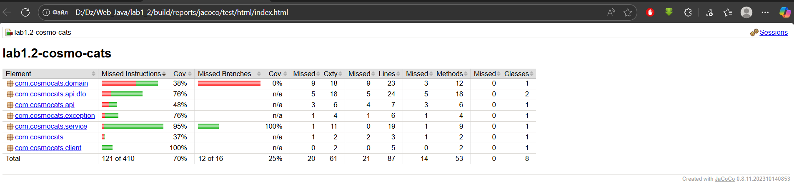

# Lab 1.2 — CosmoCats Intergalactic Marketplace 🪐  
**Course:** Java Web (Spring Boot + Gradle)  
**Author:** Andrii Burlii (ІО-32)  
**Variant:** Lab 1.2 — Unit Testing & Code Coverage  

---

## 🎯 **Мета роботи**
Протестувати функціонал інтергалактичного ринку та підготувати код до production-якості:
- Розробити **юнiт-тести** для сервісного рівня.
- Написати **тести контролера** з валідацією (позитивні та негативні кейси).
- Досягнути **покриття коду ≥ 50 %** за допомогою **JaCoCo**.
- Налаштувати **GitHub Actions CI** для автоматичної перевірки тестів та coverage.
- Реалізувати **WireMock-stubbing** для імітації зовнішніх сервісів.

---

## ⚙️ **Технології та стек**
| Layer | Technology |
|-------|-------------|
| Backend | Spring Boot 3.3.5 |
| Build tool | Gradle 8 |
| Java version | 21 (Temurin) |
| Database | H2 (in-memory) |
| Testing | JUnit 5, Mockito, WireMock |
| Coverage | JaCoCo 0.8.11 |
| CI/CD | GitHub Actions |

---

## 🧩 **Архітектура**
- **API versioning:** `/api/v1/products`
- **Service abstraction:** `ProductService` + `DefaultProductService`
- **DTO validation:** `@Valid`, `@NotBlank`, `@Positive`
- **Global exception handling:** повертає JSON-відповіді з кодом `400 Bad Request`
- **WireMock tests:** `ExternalRateClientWireMockTest`

---

## 🧪 **Тестування**
Покрито всі основні рівні:
- ✅ Сервісний шар — юніт-тести з Mockito  
- ✅ Контролер — MockMvc тести (позитивні + негативні сценарії)  
- ✅ WireMock — перевірка інтеграції із зовнішнім клієнтом  

---

## 📊 **Результати тестування**
> **Всі тести успішно пройдені.**

| Category | Result |
|-----------|--------|
| Tests passed | ✅ 12 / 12 |
| Coverage | 🟢 **~70 %** |
| Jacoco gate | ✅ ≥ 50 % (пройдено) |
| CI status | 🟢 **All checks passed** |

  
  


---

## 🚀 **Як запустити**
```bash
# Запуск програми
./gradlew bootRun

# Запуск тестів і генерація звітів
./gradlew clean test jacocoTestReport jacocoTestCoverageVerification

✅ Висновки

У ході лабораторної роботи:

-Створено юніт-тести для сервісного шару та контролерів.

-Досягнуто покриття коду ~70 %, що перевищує вимогу (50 %).

-Реалізовано WireMock-тестування для зовнішніх залежностей.

-Налаштовано CI-пайплайн GitHub Actions для автоматичної перевірки.

-Проєкт повністю відповідає вимогам до Lab 1.2.